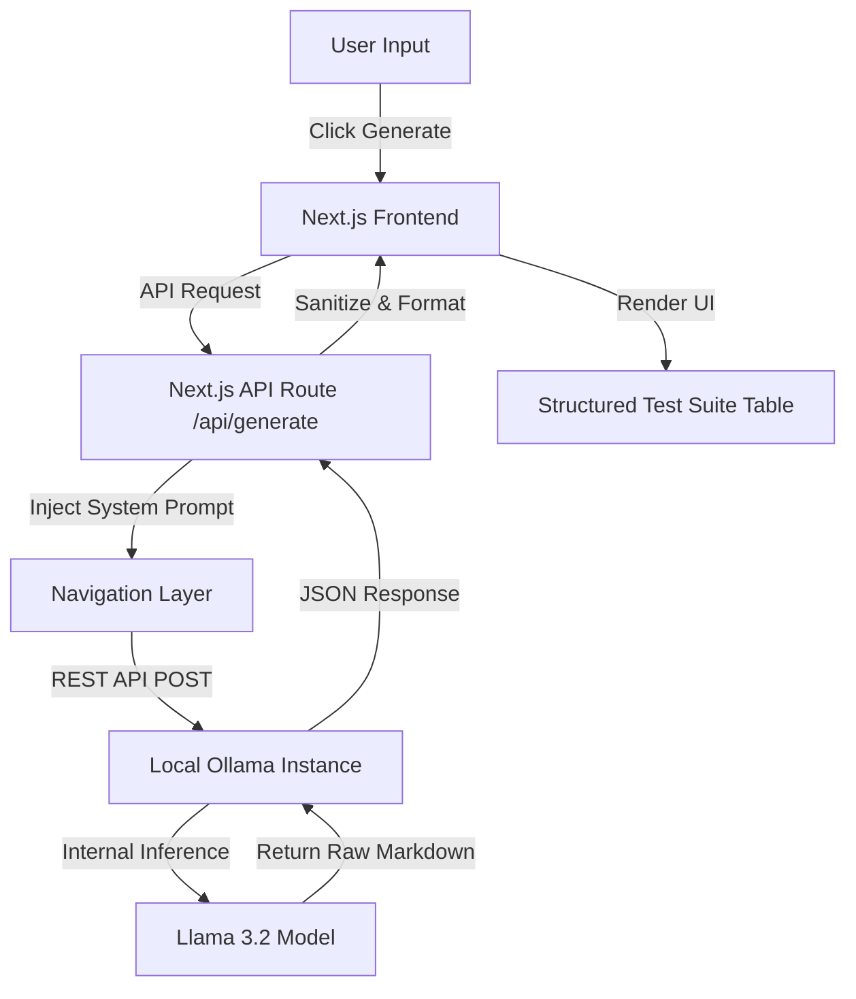

# 🧪 AutoTestGen: Local LLM Test Case Generator

AutoTestGen is a premium, locally-hosted web application that leverages the power of **Ollama** and **Llama 3.2** to generate high-quality, structured test cases from user requirements or code snippets. 

## 🏗️ How It Works

The system operates on a clean 3-layer architecture to ensure data flows reliably from your prompt to the final test suite.



### 🛠️ Architecture Layers
1.  **Architecture Layer (`/architecture`)**: The Source of Truth. Contains the Standard Operating Procedure (SOP) and the strict System Prompts that define what a "good" test case looks like.
2.  **Navigation Layer (`/api/generate`)**: The reasoning hub. It bridges the UI and the Local LLM, ensuring prompts are correctly formatted and errors (like a missing model) are handled gracefully.
3.  **Tools Layer (Ollama)**: The engine. Performs the deterministic local inference without sending your data to the cloud.

## 🚀 Getting Started

### Prerequisites
-   [Ollama](https://ollama.com/) installed and running.
-   [Node.js](https://nodejs.org/) installed.
-   Llama 3.2 pulled locally.

```bash
ollama pull llama3.2
```

### Installation
1.  Clone the repository:
    ```bash
    git clone https://github.com/aksha345/AI-Tester.git
    cd llm-test-generator
    ```
2.  Install dependencies:
    ```bash
    npm install
    ```
3.  Run the application:
    ```bash
    npm run dev
    ```
4.  Open [http://localhost:3000](http://localhost:3000) in your browser.

## ✨ Features
-   **100% Private**: Your requirements never leave your machine.
-   **Structured Output**: Generates Positive, Negative, and Edge cases in valid Markdown tables.
-   **Premium UI**: Sleek dark mode with syntax highlighting and code-copy functionality.
-   **Fast & Local**: No API keys required, no rate limits.

---
*Created with ❤️ for QA Engineers.*
